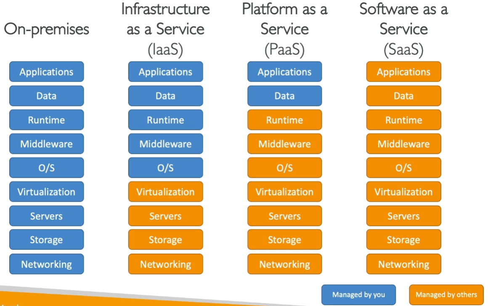
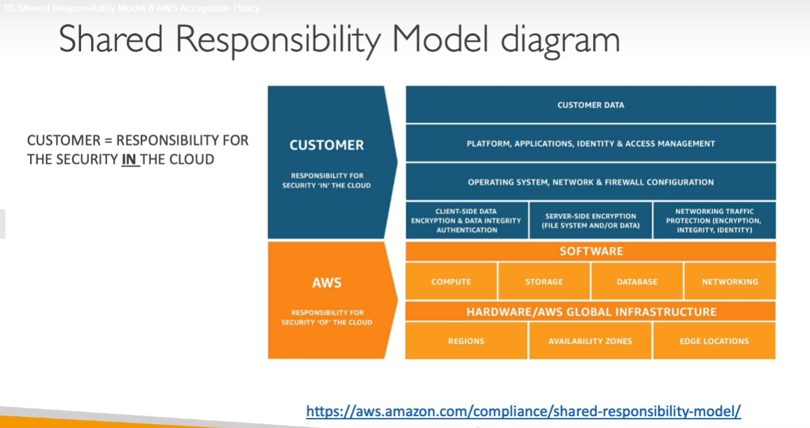

# CURSO AWS CERTIFIED CLOUD PRACTITIONER 

## O que é Cloud Computing

É a resposta ao modelo tradicional de infraestrutura (ter o próprio Servidor + Rede + Internet + etc )

 >Cloud Computing é entrega ==sob demanda== de poder computacional, banco de dados, aplicações e outros recursos de TI.

- Plataforma *pas-as-you-go*
- provisionamento do tipo e tamanho exato de recursos de computação necessários
- acesso instantâneo
- interface de acesso simples á servidores, bancos de dados e demais serviços

## Cloud Privada

- Serviços de Nuvem usados por uma única organização, não expostos ao publico
- Controle total
- Segurança para aplicações sensíveis
- necessidades específicas do negócio

## Cloud Pública 

- Recursos de Nuvem são de provedor terceiro e entregues pela Internet
- [6 vantagens da *Cloud Computing*](#6-vantagens-da-cloud-computing)

## Cloud Híbrida

- Mantém alguns servidores *on premises* e estende algumas funções para a Nuvem
- Controle sobre aplicações sensíveis na infraestrutura privada
- Flexibilidade e custo-efetivo da cloud pública

## 5 Características da Cloud Computing

- Auto-serviço *on-demand*
- Acesso de rede amplo
- Multi locação e pooling de recursos
- Rápida elasticidade e escalabilidade
- Serviço Mensurável

## 6 Vantagens da Cloud Computing

- Troca de custo de capital (CAPEX) por custo operacional (OPEX)
  - Redução do *Total Cost of Ownership* (TCO) e OPEX
- Benefício de enorme economia de escala
- Parar de adivinhar capacidade
- Aumentar velocidade e agilidade
- Parar de gastar dinheiro ao operar e manter *data centers*
- Se torne global em minutos

## Problemas Resolvidos pela Cloud

- Flexibilidade
- *pay-as-you-go* (pague pelo que usa)
- escalabilidade
- elasticidade
- alta disponibilidade e tolerância à falhas
- agilidade
  
## Tipos de Cloud Computing

- Infrastructure as a Service (IaaS)
  - fornece rede, computadores, espaço de *data storage*
  - Nível mais alto de flexibilidade
  - pode ser comparado ao modelo tradicional de infra *on-premises*
- Platform as a Service (PaaS)
  - Remove a necessidade da organização de manter a infra
  - Foco no *deploy* e gerenciamento das aplicações
- Software as a Service (SaaS)
  - O produto completo é mantido e gerenciado pelo provedor do serviço
  

### Exemplos de Tipos de Cloud Computing

- Infra as a Service
  - Amazon EC2
  - GCP, Azure, Rackspace, Linode, Digital Ocean
- Platform as a Service
  - Elastic Beanstalk (AWS)
  - Heroku, Google App Engine (GCP), Windows Azure (Microsoft)
- Software as a Service
  - Vários serviços na AWS
  - Google Apps (Gmail), Dropbox, Zoom

### Precificação da Cloud

- AWS tem 3 fundamentos de precificação seguindo o modelo de *pay-as-you-go*
- *Compute time*
- *Storage* 
- *Data Out*
  
### AWS Regions

>Localização no mundo onde estão instalados servidores da AWS
- Dentro de uma ==*Region*== podem existir 2 ou mais ==availability zones==, que são *datacenters* distintos com rede e alimentação de energia próprios
- São separados fisicamente, ficando assim isolados em caso de desastres
- São interconectados com uma rede de banda larga e latência ultra-baixa

### Modelo de responsabilidade compartilhada

## IAM